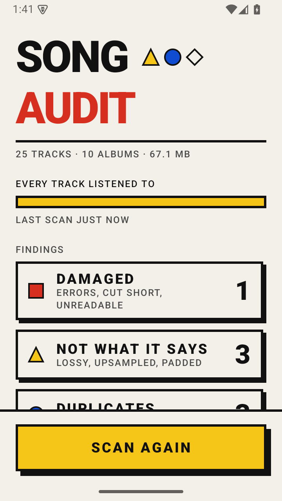
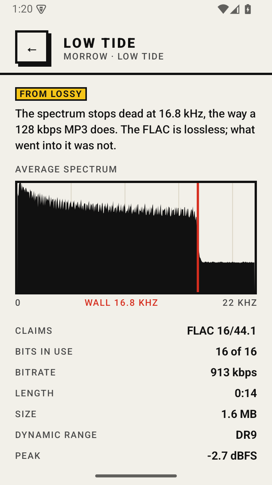
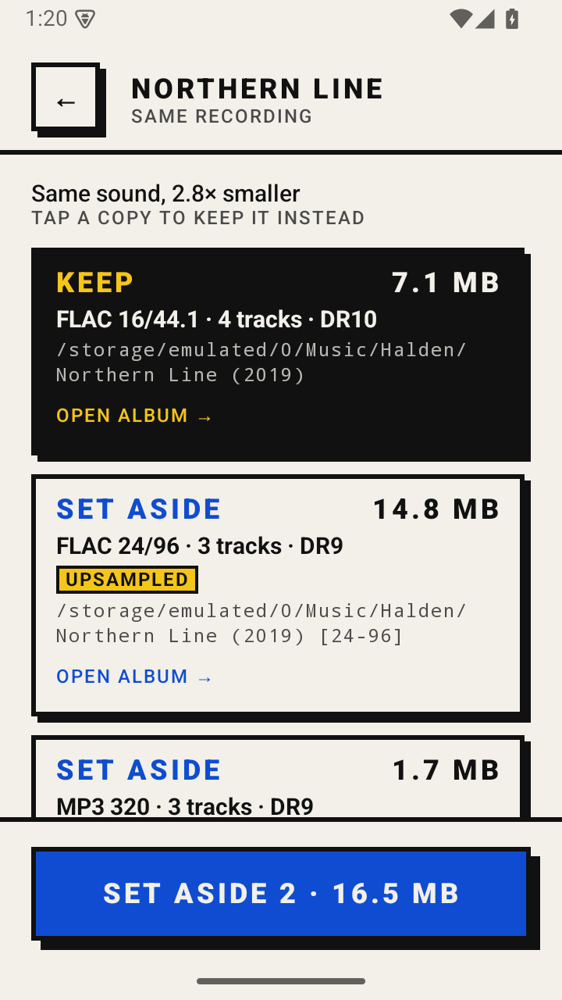

<h1>SONG AUDIT</h1>

A checker for the music on an Android player. It listens to every file and says which are damaged, which are not what their format claims, and which you have twice, then helps you fix tags and covers and shrink files to their real resolution. The app has no internet permission.

<p>
  <a href="../../releases/latest"></a>
  
  
</p>

<table>
  <tr>
    <td></td>
    <td></td>
    <td></td>
  </tr>
  <tr>
    <td align="center"><sub>Every file, listened to</sub></td>
    <td align="center"><sub>A FLAC that was an MP3</sub></td>
    <td align="center"><sub>Which copy to keep, and why</sub></td>
  </tr>
</table>

## What it finds

**Damaged.** FLAC frames that fail their checksum, audio that does not match the MD5 its encoder stored, files cut short, files that will not decode.

**Not what it says.** A FLAC made from an MP3: the spectrum stops dead at 16 to 20 kHz. Hi-res upsampled from a CD: nothing real above 22 kHz. Sixteen bits padded out to twenty-four. An MP3 re-encoded up from a lower bitrate.

**Duplicates.** Identical files, the same audio under different tags, the same recording in another format or resolution, and whole albums at once. Each group comes with a suggestion: undamaged over damaged, real lossless over lossy, complete over partial, real resolution over upsampled or padded, then higher DR, better tags, smaller. Tap another copy to keep that one instead.

**Tags and covers.** No art, 3000-pixel covers embedded in every track, albums a player will split into pieces, missing tags, missing tracks.

## What it does about it

**Set aside.** Damaged files, fakes and spare copies go to a hidden quarantine folder on the same card. That is a rename, so it is instant, and they can be put back until you empty it.

**Keep as it is.** A finding you have decided to live with leaves the list. It stays on the track's page and under Kept, one tap from going back.

**Shrink to true size.** A 24/96 FLAC upsampled from a CD is written again at 24/48, and sixteen bits padded to twenty-four go back to sixteen, with the tags and pictures kept. The new file is decoded and checked against its own MD5 before it replaces anything, and the original waits in quarantine.

**Fix tags and covers.** In FLAC and MP3:
- a missing cover found nearby (a scans folder, the folder above CD1 and CD2, another copy of the album) or chosen from the device, then embedded;
- heavy covers shrunk to 1000 px, with the full-size picture kept once as cover.jpg;
- one album name and album artist across a folder, and Various Artists with the compilation flag for a compilation;
- titles, track numbers, album and artist read from file and folder names.

Every change is listed before anything is written. The audio is never touched: each file's old tags go to the quarantine first, and undoing the fix there puts the file back byte for byte.

## How

Tags are read in minutes. Then every file is decoded in full: FLAC by the app's own decoder, which checks every frame's CRC and the stream's MD5 (it also has its own encoder, for shrinking); WAV and AIFF straight from disk; MP3, AAC, ALAC, Ogg and Opus through Android's MediaCodec. DSD, APE and WavPack are checked by their tags only.

From each track it keeps an averaged spectrum (where a lossy encoder or a resampler cut it off), the bits actually in use, the TT dynamic range, and an acoustic fingerprint, 32 bits every 46 ms, that matches the same recording across formats, sample rates and offsets.

The listen runs in the background, can be held to the charger, and picks up where it stopped. It was made for a HiBy R4 and its 4.7" screen; any Android 8.0 player or phone will do.

## Design

It looks like [GRID CHESS](https://github.com/solidens/grid-chess) and [GRID BACKGAMMON](https://github.com/solidens/grid-backgammon). Red is damage, yellow is "not what it says", blue is a copy of something you already have.

## Build

```bash
brew install openjdk@21
brew install --cask android-commandlinetools
./gradlew :app:assembleDebug
```

The tests read generated audio. `python3 tools/fixtures.py` makes it (numpy and ffmpeg needed), then `./gradlew :app:testDebugUnitTest`. `python3 tools/demo_library.py out/` builds a small library with one of every finding, to try the app without a real collection.

Release signing reads `keystore.properties` from the project root.

## Licence

GPL-3.0. See [LICENSE](LICENSE) and [NOTICE](NOTICE).
